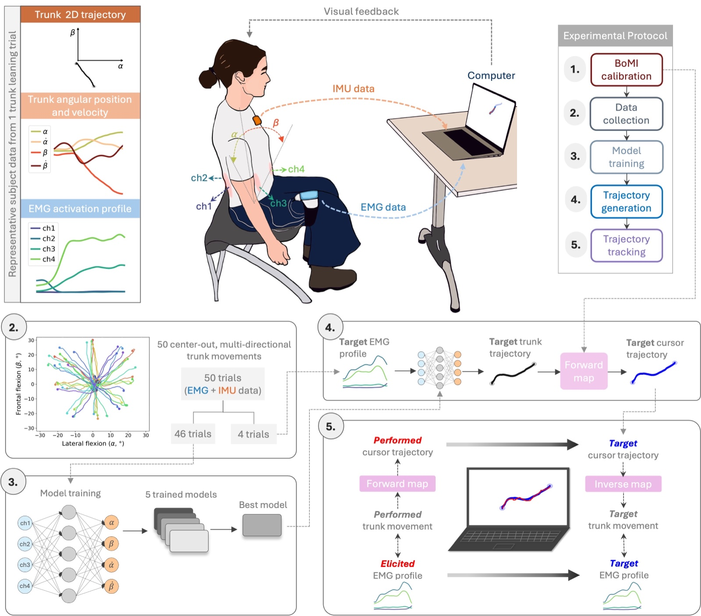
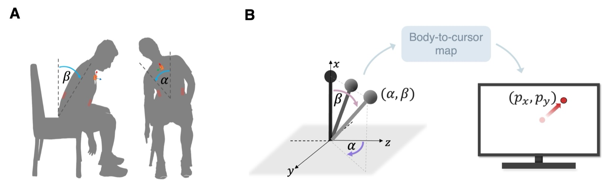
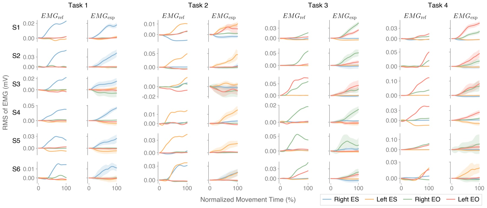

# EMG-based Body–Machine Interface for Targeted Trunk Muscle Activation

Code for the paper:

> C. Correia, A. Bandini, S. Micera, S. Moccia. **EMG-based body–machine interface for targeted trunk muscle activation.** *Informatics in Medicine Unlocked* 56 (2025) 101641. [doi:10.1016/j.imu.2025.101641](https://doi.org/10.1016/j.imu.2025.101641)

This body–machine interface (BoMI) combines trunk motion (IMU) and trunk muscle activity (surface EMG) with the aim of guiding users toward **predefined trunk muscle activation patterns**. A personalized LSTM network learns each user's EMG–motion relationship and turns a target EMG profile into a trunk motion trajectory. The trajectory is shown on screen as a moving target, which the user tracks by moving their trunk to control a cursor. The hypothesis is that tracking the target leads the user to approximate the muscle activation encoded in it.


*Experimental setup and BoMI framework: EMG is recorded bilaterally from the lumbar erector spinae and external obliques, and an IMU on the sternum measures trunk angles. Data are streamed to a computer for online processing and visual feedback (figure from the paper).*

## How it works

**Body-to-cursor mapping.** An IMU on the sternum measures trunk flexion in the sagittal and frontal planes, θ = [α, β]. These are mapped to the cursor position with an affine transformation **p = H·θ + b**, where **H** is calibrated from the user's trunk range of motion.



**EMG processing.** Four muscles are recorded bilaterally with an OTB Sessantaquattro+ at 2 kHz: lumbar erector spinae (ES) and external obliques (EO). The signals are band-pass filtered (10–400 Hz) and high-pass filtered (30 Hz, to remove ECG). The RMS is then computed on 150 ms windows with a 10 ms step and low-pass filtered.

**Trajectory generation.** An autoregressive LSTM (2 layers, 256 hidden units, 1 s input window) predicts trunk position and velocity from past EMG and past kinematics. Given a target EMG profile, it generates the trunk trajectory that the user will track.

## Experimental protocol → code

The study protocol has four stages, each mapped to part of this repository:

| Stage | What happens | How to run it |
|-------|--------------|---------------|
| **0. Calibration** | IMU pose and range-of-motion calibration (→ **H**); EMG maximum voluntary contraction | `imu-calibration.launch`, `emg-calibration.launch` |
| **1. Data collection** | 50 self-paced, center-out trunk movements (5 s each) with IMU and EMG recorded | `imu-control.launch` with `interface.task: 'training'` |
| **2. Model training** | Recordings are resampled to 100 Hz, windowed and normalized; LSTM models are trained per user | `scripts/preprocess.py`, `scripts/train.py` |
| **3. Trajectory generation** | Four held-out EMG patterns (each targeting mainly one muscle) are fed to the LSTM to generate four trajectories | `scripts/test.py` |
| **4. Trajectory tracking** | The user tracks the moving targets with trunk movements (IMU control) while EMG is recorded | `imu-control.launch` with `interface.task: 'path_following'` |

### Step by step

1. **Start the IMUs**
   ```bash
   roslaunch hiros_xsens_mtw_wrapper custom_configuration_example.launch
   ```
2. **Calibrate.** Set the subject and recording options in `cfg/params.yaml` first.
   ```bash
   roslaunch bomicontrol imu-calibration.launch
   roslaunch bomicontrol emg-calibration.launch
   ```
3. **Collect training data.** Set `interface.task: 'training'`, then run
   ```bash
   roslaunch bomicontrol imu-control.launch
   ```
   Relaunch the IMUs between blocks to limit drift.
4. **Preprocess** the recorded trials (set the file names in the config):
   ```bash
   python3 src/bomi-control/scripts/preprocess.py
   ```
5. **Train the LSTM.** Set the files and date in `cfg/model_params.yaml`; a GPU is recommended.
   ```bash
   python3 src/bomi-control/scripts/train.py
   ```
6. **Generate the target trajectories.** Run this on the experiment machine, because the trajectories are scaled to its screen size.
   ```bash
   python3 src/bomi-control/scripts/test.py
   ```
7. **Trajectory tracking.** Set `interface.task: 'path_following'` and run `imu-control.launch`.

`emg_control.launch` is an additional mode, not used in the paper. In it, the cursor is driven directly by the trunk angles that the LSTM predicts from live EMG (`hmi_emg.py`).

## Results

In six neurotypical participants, the elicited EMG profiles were similar to the target ones, with a mean similarity index of 0.82 ± 0.13 and a correlation coefficient of 0.95 ± 0.03. These results support the feasibility of the approach, but they have limitations:

- The sample is small (six participants) and neurotypical. Patients with trunk impairments often have more variable EMG and movement, which could weaken the EMG–motion relationship the LSTM relies on.
- The target EMG profiles came from each participant's own recorded movements. The system has not yet been tested with profiles defined by a therapist.
- Only four trunk muscles and movements in the sagittal and frontal planes were considered; axial rotation was not.


*Reference (target) and elicited EMG profiles of the four trunk muscles, for each participant and task (figure from the paper).*

## Repository layout

This is a ROS 1 (catkin) workspace with one package, `bomicontrol`, in `src/bomi-control`:

```
src/bomi-control/
├── nodes/            ROS nodes (sensors, interface, calibration, recording)
├── launch/           roslaunch files for calibration, control and recording
├── cfg/              YAML configuration + path helpers (cfg/tools.py)
├── sensors/
│   ├── emg/          OTB Sessantaquattro(+) clients, TCP communication and EMG processing tools
│   └── imu/          Xsens IMU client and IMU processing/synchronization tools
├── emg_regression/
│   ├── approximators/lstm.py   LSTM model (PyTorch)
│   └── utils/                  data processing, training and plotting helpers
├── interface/        cursor display and task helpers (OpenCV GUI)
└── scripts/          offline preprocessing, training, trajectory generation, example notebook
```

| Node | Role |
|------|------|
| `imu_node.py` | Reads Euler angles from the Xsens IMUs |
| `emg_node.py` | Streams EMG from the Sessantaquattro and publishes it |
| `calibrate_imu.py` / `calibrate_emg.py` | IMU calibration / EMG MVC calibration |
| `hmi_imu.py` | Maps trunk angles (IMU) to cursor commands |
| `hmi_emg.py` | Predicts trunk angles from EMG with the trained LSTM (EMG-control mode) |
| `cursor_node.py` | Cursor dynamics |
| `gui_node.py` | Task GUI: free cursor, training and trajectory-tracking modes |
| `save_node.py` | Records all EMG / IMU / cursor / task topics to disk |
| `emg_vis.py` | Real-time EMG visualization |

## Requirements

- Ubuntu with ROS 1 (Noetic) and catkin
- [`hiros_xsens_mtw_wrapper`](https://github.com/HiROS-unipd/xsens_mtw_wrapper): ROS driver for the Xsens MTw IMUs, by Hi-ROS (University of Padova). Clone it into the workspace's `src/` folder next to `bomi-control`; it needs the [Xsens MTw Awinda SDK](https://www.xsens.com/products/mtw-awinda). Configure its launch file for one MTw at 120 Hz with Euler angles published (`number_of_mtws: 1`, `desired_update_rate: 120`, `publish_euler: true`), since the nodes subscribe to its `Euler` messages.
- Python 3 with `numpy scipy matplotlib pandas seaborn torch pyyaml pyautogui opencv-python`
- Hardware: Xsens MTw Awinda IMU and an OTB Sessantaquattro+ EMG amplifier, connected over the network (set its IP in `cfg/emg.yaml`)

## Setup

```bash
cd bomi-trunk
catkin_make
source devel/setup.bash
```

The code finds the workspace from its own location. To keep the data elsewhere, set:

```bash
export BOMI_WS=/path/to/bomi-trunk/   # data is read/written under $BOMI_WS/data/subjects/
```

Notebooks assume they are run from `src/bomi-control/scripts/`, or that `BOMI_WS` is set.

### Configuration

All settings are in `src/bomi-control/cfg/`:

- `params.yaml` – subject ID, what to record, interface task (`free`, `training`, `path_following`, `sim`), trial settings
- `model_params.yaml` – LSTM architecture, windowing and training settings, data files to use
- `emg.yaml`, `imu.yaml`, `cursor.yaml` – sensor and cursor settings

Data, calibrations and trained models are saved under `data/subjects/<subject>/<date>/`. Recordings go into `<task>/<modality>/`. `<task>` is `training` or `testing` (trajectory tracking). `<modality>` is the input that controlled the cursor (`record.modality` in `params.yaml`, e.g. `imu`); EMG is always recorded.

## Data

The study data are not included in this repository. They can be made available upon reasonable request (see the paper's data availability statement); please contact the author.

The code expects each session in `data/subjects/<subject>/<date>/`, with this structure:

| Folder | Contents |
|--------|----------|
| `training/<modality>/` | Data-collection recordings (`data_HH_MM.pkl`) and preprocessed arrays, train/test splits and normalization stats (`.npy`) |
| `testing/<modality>/` | Trajectory-tracking recordings, plus reference EMG/IMU trajectories (`ref_*.npy`) |
| `model/` | Trained LSTM models (`.pt`) and their configs (`*_config.yaml`) |
| `interface/` | IMU calibration (`H_imu_*.npy`, `R_init.npy`), screen settings, EMG MVC, predicted vs true trajectories |
| `figs/` | Result figures |
| `files.yaml` | Which recordings are training (data collection) and which are testing (tracking) trials |

These folders are created automatically when you record a new session (`set_paths` in `cfg/tools.py`).

`src/bomi-control/scripts/example_collected_data.ipynb` is saved with the outputs from one study participant, so you can see what the collected data look like without the data itself.

## Citation

If you use this code, please cite:

```bibtex
@article{correia2025emgbomi,
  title   = {EMG-based body--machine interface for targeted trunk muscle activation},
  author  = {Correia, Carolina and Bandini, Andrea and Micera, Silvestro and Moccia, Sara},
  journal = {Informatics in Medicine Unlocked},
  volume  = {56},
  pages   = {101641},
  year    = {2025},
  doi     = {10.1016/j.imu.2025.101641}
}
```

## Author

Carolina Correia (cgprcorreia@gmail.com)

## License

The code is released under the MIT License (see [`LICENSE`](LICENSE)). The figures in `docs/figures/` are from the paper, which is published open access under [CC BY-NC-ND 4.0](https://creativecommons.org/licenses/by-nc-nd/4.0/).
